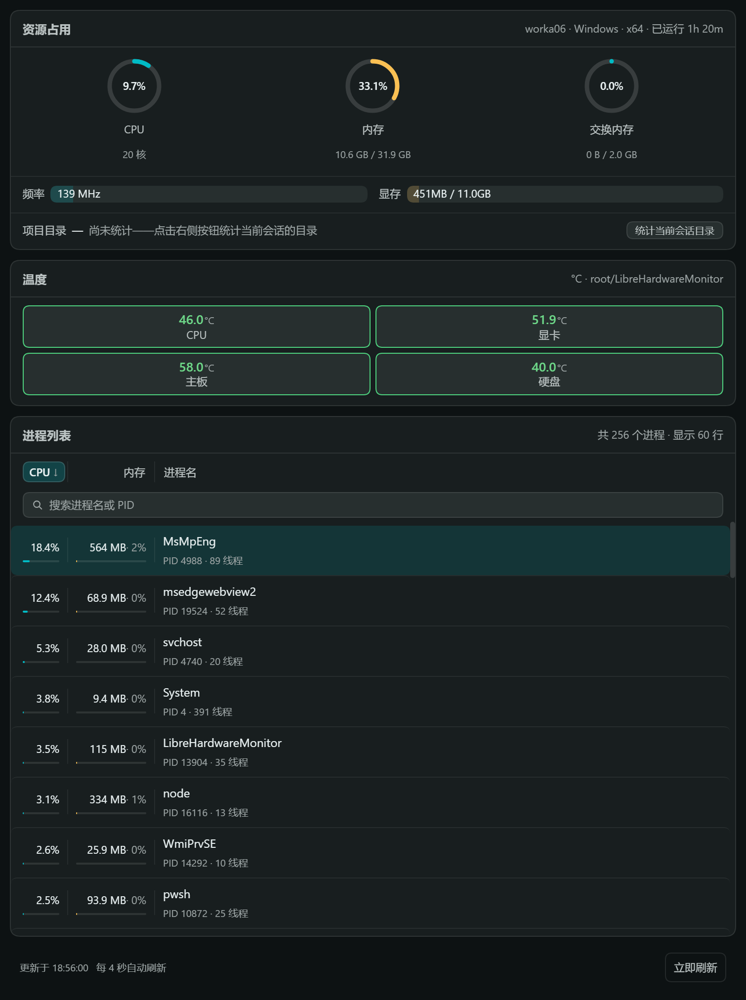

# @xmwengxing/dsh-client-ui-sidebar-perfmon

Real-time host performance monitoring for the [DeepSeek Harness](https://github.com/deepseek-ai/deepseek-harness)
right Sidebar: CPU, memory and swap gauges, GPU clock and VRAM, CPU / GPU /
motherboard / drive temperatures, plus a sortable process table — on Linux,
macOS and Windows.

English | [中文](README.zh-CN.md)



## What it does

One page in the right Sidebar, one button in the Session header:

- **Resource usage** — ring gauges for CPU, memory and swap, each with a
  supporting line (cores and load, used of total, swap state); a **GPU bar**
  splitting the core clock and dedicated VRAM into two halves with progress
  fills; the viewed session's project-folder size on demand; the host's name and
  uptime in the card header.
- **Temperatures** — CPU, GPU, motherboard and drive tiles on a cool / warm / hot
  scale (70 °C and 85 °C). A tile shows its hottest sensor, so a multi-core
  package or a pair of drives stays readable, and its tooltip names every sensor
  it covers. See [Temperatures](#temperatures) for what each platform can answer.
- **Processes** — one row per process: CPU share, resident memory, its share of
  RAM, PID and thread count. Sort by CPU, memory or name, filter by name or PID,
  drag a column divider to resize (widths are remembered per browser). The metric
  columns never shrink, so a narrow Sidebar loses names before it loses numbers.
- **Refresh** — one interval drives every window (2 s Linux / 3 s macOS / 4 s
  Windows by default), and polling pauses while the browser tab is hidden. The
  temperature card is the exception: it moves on its own calmer cadence, because
  a temperature is an absolute reading and is expensive to read on Windows.

A figure no platform can answer shows `—` with the reason in its tooltip —
never a `0`, because zero reads as a measurement.

## Requirements

- **Linux, macOS or Windows** — which figures each one can answer is in
  [Platform support](#platform-support).
- **DeepSeek Harness `0.2.0-rc.1` or a compatible release**, on a profile that
  boots `@deepseek-ai/dsh-web-app` (the `web` profile does).

No runtime dependencies: the host half uses `node:os` and each platform's own
tools, and the browser half uses the React the GUI already provides.

## Install

```sh
# From npm
dsh plugin --profile web add @xmwengxing/dsh-client-ui-sidebar-perfmon

# From a local checkout
dsh plugin --profile web add /path/to/dsh-client-ui-sidebar-perfmon

# From git (pnpm must be allowed to run the build first)
dsh plugin --profile web add github:xmwengxing/dsh-client-ui-sidebar-perfmon
```

Then restart the GUI. Remove it again with
`dsh plugin --profile web remove @xmwengxing/dsh-client-ui-sidebar-perfmon`.

To open the panel: the right Sidebar's guide page lists a **性能监控** card that
opens the page as a tab; from then on the **性能监控信息** button in the Session
header opens or focuses that tab.

## Configuration

The defaults are deliberately calm — one `/proc` walk every two seconds, shared
between every open panel. Override them in a profile patch when needed:

```yaml
# ~/.dsh/profiles/web/cordis.patch.yml
- id: perfmon
  name: '@xmwengxing/dsh-client-ui-sidebar-perfmon'
  config:
    refreshIntervalMs: 1000        # 500–60000; default 2000 Linux / 3000 macOS / 4000 Windows
    processLimit: 100              # 5–500; rows served per response
    cacheMillis: 800               # 0–10000; polls inside this window share one reading
    sampleMillis: 150              # 0–2000; length of the first reading's priming sample
    projectDirEntryBudget: 50000   # 100–1000000; entries one folder's scan may examine
    projectDirMaxDirs: 12          # 1–100; distinct folders one scan may cover
    temperatureIntervalMs: 15000   # 2000–600000; how long one temperature reading is reused
    gpuIntervalMs: 4000            # 500–60000; defaults to refreshIntervalMs
    # gpu: false                   # hide the GPU line entirely
    # temperature: false           # hide the temperature card entirely
    # projectDir: /srv/demo        # pin one folder instead of the viewed session's workspace
    # projectDir: ''               # or hide the directory-size line entirely
```

## Platform support

One reader per platform family, each reading the platform's own source.

| | Linux | macOS | Windows |
| --- | --- | --- | --- |
| CPU %, per-core | `/proc/stat` | `os.cpus()` | `os.cpus()` |
| Load average | yes | yes | **no** — Windows has no such concept, so the line is omitted |
| Memory total / used / available | `/proc/meminfo` (`MemAvailable`) | `vm_stat` (free + reclaimable pages) | `Win32_OperatingSystem` + `AvailableBytes` |
| Cache / buffers line | `Cached`, `Buffers` | file-backed pages as cache; no buffer figure | `CacheBytes`; no buffer figure |
| Swap | `/proc/meminfo` | `sysctl vm.swapusage` | page file (`SizeStoredInPagingFiles`) |
| Process list | `/proc/<pid>/stat`, in-process | `ps -Ao pid=,state=,time=,rss=,comm=` | one PowerShell call |
| Process state | yes | yes | **no** — shown as `—` |
| Thread count | yes | **no** — BSD `ps` has no portable keyword | yes |
| Temperatures | `/sys/class/hwmon`, else `/sys/class/thermal` | `powermetrics` (root), `osx-cpu-temp`, `istats` | LibreHardwareMonitor / OpenHardwareMonitor, ACPI zone, storage counters, `nvidia-smi` |
| Project-directory size | in-process walk, all three platforms alike | same | same |

Anything a platform cannot answer is reported as `null` and rendered as `—`,
with the reason in the panel: a temperature tile's reason is in that tile's
tooltip, and the reading's other warnings hang on the footer timestamp. Nothing
is filled in with a zero.

**Cost.** Linux reads `/proc` in-process and spawns nothing. macOS and Windows
spawn one helper per sample, so their default refresh is calmer — 3 s and 4 s
against Linux's 2 s — and `refreshIntervalMs` overrides it. A platform without a
dedicated reader (FreeBSD, Solaris, …) falls back to a `node:os`-only reader:
real CPU and memory totals, with swap and the process table marked unavailable
rather than guessed.

### How the numbers are produced

Every percentage is a difference between two samples of a cumulative counter, so
the plugin never assumes a tick rate. Two conventions are worth knowing:

- **Process CPU is scaled so 100% means one core** — the `top` convention, so an
  eight-thread process on four cores can read above 100%.
- **Memory "used" means "not available"**: page cache is reclaimable, so it
  counts as available, not as used.

The first reading of a session is primed with a short second sample, so the
panel opens on a real percentage rather than a zero. Two states are reported
honestly instead: a **process first seen in the current window** shows `—` until
it has a second sample to difference against, and a **host without swap** shows
"未启用" rather than an empty 0% ring.

### The project-directory line

Measuring a folder is CPU- and IO-heavy work, so the line under the gauges is
**manual by design**: its button scans the workspace folder of the session you
are viewing, can be stopped mid-walk (keeping the partial figures with an
explicit "stopped" note), and is bounded — 50,000 entries per folder, 12 folders
per scan, symlinks neither followed nor counted, with every shortcut named beside
the figure. Between scans the polling reads only the stored result, so an open
panel costs nothing.

### GPU clock and VRAM

| Figure | Linux | macOS | Windows |
| --- | --- | --- | --- |
| VRAM used / total | `amdgpu` sysfs (`mem_info_vram_*`); `nvidia-smi` | `nvidia-smi` only | the OS's own `GPUPerformanceCounters` memory counter (any vendor, **nothing installed**), plus the 64-bit adapter total from the registry; `nvidia-smi` when present |
| Core clock | `gt_cur_freq_mhz` (i915) or `amdgpu` `pp_dpm_sclk`; `nvidia-smi` | `nvidia-smi` only | `nvidia-smi` (NVIDIA) or a running LibreHardwareMonitor / OpenHardwareMonitor (other vendors) |

- **VRAM needs no third-party software.** On Windows the operating system reports
  dedicated usage for NVIDIA, AMD and Intel alike, and the adapter's true 64-bit
  total comes from the display class registry key — deliberately **not**
  `Win32_VideoController.AdapterRAM`, a 32-bit field that wraps at 4 GiB.
- **The clock has no OS-level source on Windows**, so on a machine with neither
  `nvidia-smi` nor a hardware monitor the clock shows `—` while VRAM still reads,
  instead of a percentage invented from a guessed maximum clock.

The two figures share one row — clock left, VRAM right, each a track with its own
fill (the clock's against its own boost ceiling, VRAM's as used-of-capacity) —
wrapping to two full-width rows rather than clipping when the Sidebar is too
narrow for both. The bar refreshes with the panel (`gpuIntervalMs`, defaulting to
`refreshIntervalMs`), because VRAM is the figure that matters while a model
loads. `gpu: false` hides it.

### Temperatures

A temperature is an absolute value, not a counter, so it gets its own calmer
cadence: one reading is reused for `temperatureIntervalMs` (15 seconds by
default) because a Windows read costs a second-plus PowerShell call.

| Component | Linux | macOS | Windows |
| --- | --- | --- | --- |
| CPU | `coretemp` / `k10temp` / `zenpower` / `cpu_thermal` and friends; `x86_pkg_temp` zone | `powermetrics` CPU die; `osx-cpu-temp`; `istats` | LibreHardwareMonitor / OpenHardwareMonitor `/intelcpu/`, `/amdcpu/` |
| GPU | `amdgpu` / `radeon` / `nouveau` / `i915` / `xe` chips | `powermetrics` GPU die; `istats` | the monitor's `/nvidiagpu/`, `/atigpu/`; else `nvidia-smi` |
| Motherboard | `acpitz`, `it87`, `nct6775`, `dell_smm`, `thinkpad` and friends | — | ACPI zones; the monitor's `/lpc/` |
| Drives | `nvme`, `drivetemp` chips | — | `Get-StorageReliabilityCounter` per physical drive |

- **The ACPI thermal zone is the motherboard, never the CPU** — by ACPI's own
  definition it is a board sensor, and on many desktop boards it is a near-constant
  placeholder (this machine reported 27.9 °C under an all-core load).
- **Windows CPU temperature needs a hardware monitor**: run LibreHardwareMonitor
  **0.9.4** (the portable zip, as administrator — 0.9.6 dropped the WMI provider
  this plugin reads) or OpenHardwareMonitor; without one the CPU tile is `—` with
  the reason. Intel's `Distance to TjMax` is headroom, not a temperature, and is
  excluded.
- **macOS needs a root or user-installed source**: `powermetrics` as root, or
  `osx-cpu-temp` / `istats` installed. With none of them every tile is `—`.

## Privacy

The plugin reads local kernel counters and returns them only to the browser that
asked. It makes no network requests of its own, sends nothing anywhere, and
writes no files. The route is protected by the same auth as the rest of the GUI.

## Limitations

- **No process owner, command line or process tree.** Each row carries name, PID,
  state, thread count, CPU and resident memory.
- **Temperatures depend on what the platform exposes** (see
  [Temperatures](#temperatures)); a machine with no source shows `—` and the
  reason rather than a borrowed number.
- **No fan speeds, voltages or per-core detail** in the tiles: the headline is a
  component's hottest sensor, and every sensor it covers is in the tooltip.
- **No history** — current readings only, no sparklines or retained samples.
- **Polling, not streaming** — refreshes are interval requests, not pushed.
- **The header button opens the panel, it does not toggle it**; closing it is the
  Sidebar's own control.

## License

MIT
